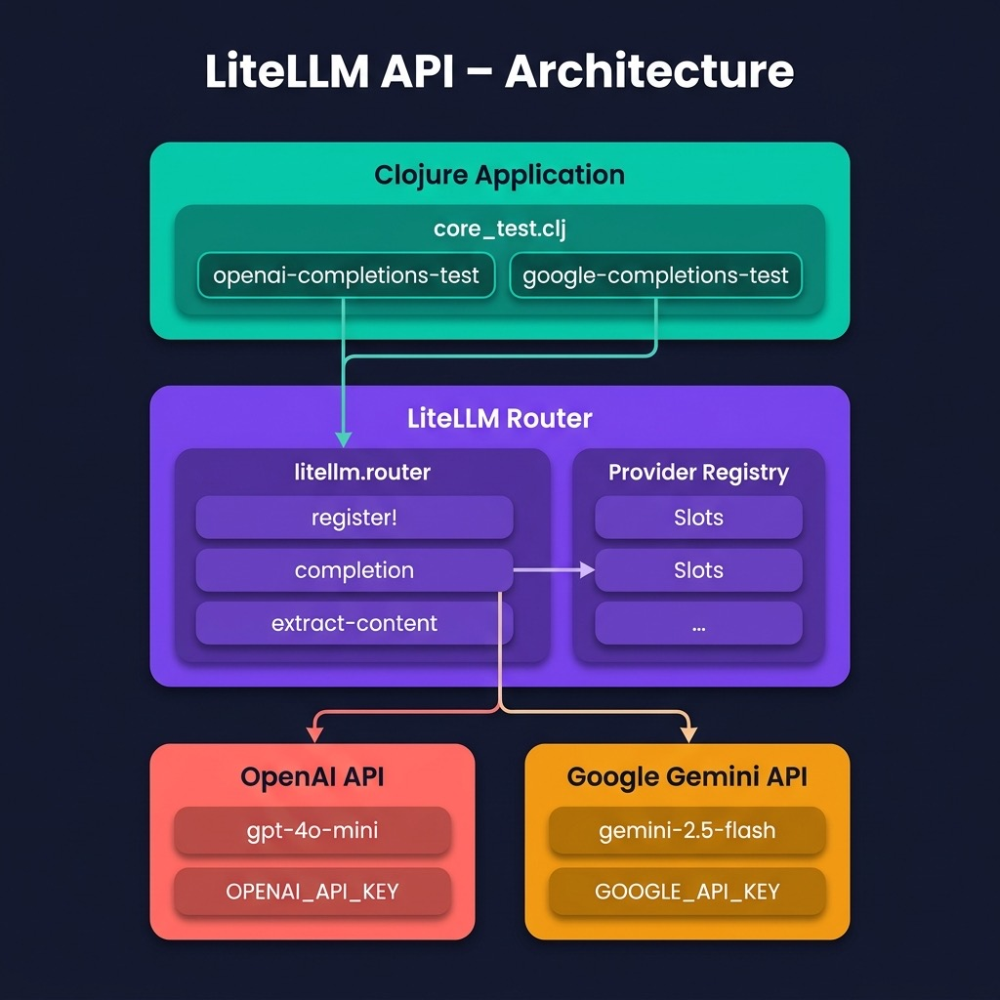

# Using the LiteLLM-CLJ Library as a Universal LLM Interface

In the earlier LLM chapters we wrote separate Clojure wrapper libraries for OpenAI, Google Gemini, and Ollama. Each wrapper had its own HTTP plumbing, JSON parsing, and response-extraction logic. While this approach is instructive (it teaches you how the REST APIs work at a low level) it also means that switching between providers requires learning a new API surface and maintaining separate code paths.

The [litellm-clj](https://github.com/unravel-team/litellm-clj) library by the Unravel team solves this problem by providing a single, unified Clojure interface that works with multiple LLM providers. It is a Clojure port inspired by the popular Python [LiteLLM](https://github.com/BerriAI/litellm) project. You register a named model configuration once — specifying the provider, model name, and API key — and then call the same `router/completion` function regardless of whether the backend is OpenAI, Google Gemini, Anthropic, Mistral, Ollama, or OpenRouter. The library handles the provider-specific HTTP details, request formatting, and response normalization behind the scenes.

For the full API documentation please refer to the [litellm-clj GitHub repository](https://github.com/unravel-team/litellm-clj) and the [cljdoc API reference](https://cljdoc.org/d/tech.unravel/litellm-clj/latest).

The source code for this chapter's example can be found at: **Clojure-AI-Book-Code/litellm_api**.

## Project Setup

The project uses three key dependencies: the **litellm-clj** library itself for the router abstraction, **clj-http** for the underlying HTTP calls, and **malli** for schema validation of request and response data. Here is the **project.clj**:

```clojure
(defproject openai_api "0.1.0-SNAPSHOT"
  :description "LiteLLM-CLJ Example"
  :url "https://markwatson.com"
  :license {:name "EPL-2.0 OR GPL-2.0-or-later WITH Classpath-exception-2.0"
            :url "https://www.eclipse.org/legal/epl-2.0/"}
  :dependencies [[org.clojure/clojure "1.11.1"]
                 [clj-http "3.12.3"]
                 [org.clojure/data.json "2.3.1"]
                 [tech.unravel/litellm-clj "0.3.0-alpha"]
                 [metosin/malli "0.20.0-alpha2"]]
  :repl-options {:init-ns litellm.core})
```

You will need API keys for the providers you want to use. Set them as environment variables before running:

    export OPENAI_API_KEY=your_openai_key_here
    export GOOGLE_API_KEY=your_google_key_here

## How the Router Works

The core abstraction in litellm-clj is the **router**. The workflow is simple:

1. **Register** a named configuration with `router/register!`. Each configuration specifies a provider keyword (`:openai`, `:gemini`, `:anthropic`, `:ollama`, etc.), a model name, and provider-specific configuration such as an API key.
2. **Call** `router/completion` with the configuration name and a standard message list. The request format follows the OpenAI chat completions convention: a vector of maps with `:role` and `:content` keys.
3. **Extract** the generated text from the response using `router/extract-content`, which handles the provider-specific response format differences for you.

This pattern means you can swap providers by changing a single `router/register!` call — the rest of your application code stays the same.

The library currently supports the following providers: `:openai`, `:gemini`, `:anthropic`, `:mistral`, `:ollama`, and `:openrouter`.

## OpenAI Completions Example

Our first example registers an OpenAI configuration using the `gpt-4o-mini` model and sends a simple prompt. The test code lives in **test/litellm_api/core_test.clj**:

```clojure
(ns litellm-api.core-test
  (:require [clojure.test :refer :all]
            [litellm.router :as router]))

(deftest openai-completions-test
  (testing "OpenAI completions API with LiteLLM"
   (router/register!
    :fast
    {:provider :openai
     :model "gpt-4o-mini"
     :config {:api-key (System/getenv "OPENAI_API_KEY")}})
   (let [response (router/completion :fast
                   {:messages [{:role :user :content "please generate a 10 word sentence"}]})]
     (println (router/extract-content response))
     (is (not (nil? response))))))
```

{width: "80%"}


Let's walk through this code. First, we require `litellm.router` and alias it as `router`. We then call `router/register!` with the keyword `:fast` as a name for this configuration. The configuration map specifies `:openai` as the provider, `"gpt-4o-mini"` as the model, and the API key from the environment. The name `:fast` is arbitrary — you could register multiple configurations (e.g., `:fast` for a small model, `:smart` for a large one) and switch between them in your application logic.

The call to `router/completion` takes the configuration name and a map containing a `:messages` vector. This follows the OpenAI chat completions format that has become a de facto standard across LLM APIs. The `router/extract-content` helper function pulls the generated text string out of the provider-specific response structure.

Here we run just this single test:

```bash
$ make gemini
lein test :only litellm-api.core-test/gemini-completions-test

lein test user

Ran 0 tests containing 0 assertions.
0 failures, 0 errors.
Marks-MacBook-Air:litellm_api $ make openai
lein test :only litellm-api.core-test/openai-completions-test

lein test litellm-api.core-test
07:06:19.948 [main] INFO litellm.config -- Registered configuration {:config-name :fast}
The sun set behind the mountains, painting the sky orange.
{:id chatcmpl-Dg9wkJ8gvJvOR3Dz0IjajCa9Ciy0y, :object chat.completion, :created 1778940382, :model gpt-4o-mini-2024-07-18, :choices ({:index 0, :message {:role :assistant, :content The sun set behind the mountains, painting the sky orange.}, :finish-reason :stop}), :usage {:prompt-tokens 14, :completion-tokens 12, :total-tokens 26}}

Ran 1 tests containing 1 assertions.
0 failures, 0 errors.
```

The response structure is normalized by the library to follow a consistent shape regardless of the provider. The `:choices` key contains a sequence of completion alternatives (usually just one), each with a `:message` map containing the `:role` and `:content`. The `:usage` map reports token counts which is useful for monitoring costs. The `:finish-reason` of `:stop` indicates the model completed its response naturally rather than being cut off by a token limit.


## Google Gemini Completions Example

Switching to Google Gemini requires only a change to the `router/register!` call — the rest of the code is identical. This is the whole point of the litellm-clj abstraction: provider details are isolated in the registration step.

```clojure
(deftest gemini-completions-test
  (testing "Google Gemini completions API with LiteLLM"
   (router/register!
    :fast
    {:provider :gemini
     :model "gemini-2.5-flash"
     :config {:api-key (System/getenv "GOOGLE_API_KEY")}})
   (let [response (router/completion :fast
                   {:messages [{:role :user :content "please generate a 10 word sentence"}]})]
     (println (router/extract-content response))
     (is (not (nil? response))))))
 ```

Notice that the only differences from the OpenAI example are the `:provider` keyword (`:gemini` instead of `:openai`), the `:model` name (`"gemini-2.5-flash"` instead of `"gpt-4o-mini"`), and the environment variable used for the API key (`GOOGLE_API_KEY` instead of `OPENAI_API_KEY`). The `router/completion` call and the `router/extract-content` helper are completely unchanged.

 Here we run just this single test:

```bash
$ make gemini
lein test :only litellm-api.core-test/gemini-completions-test

lein test litellm-api.core-test
07:10:01.910 [main] INFO litellm.config -- Registered configuration {:config-name :fast}
The swift fox ran over seven green grassy hills now.
{:id The swift fox ran over seven green grassy hills now., :object chat.completion, :created 1778940602, :model gemini-unknown, :choices ({:index 0, :message {:role :assistant, :content The swift fox ran over seven green grassy hills now., :tool-calls ({:id 2bf9efd2-45c8-4115-9bd9-82927ca3131c, :type function, :function {:name nil, :arguments null}})}, :finish-reason nil}), :usage {:prompt-tokens 0, :completion-tokens 0, :total-tokens 0}}

Ran 1 tests containing 1 assertions.
0 failures, 0 errors.
```


You can see that the Gemini response is normalized into the same structure as the OpenAI response, though some fields differ in their populated values. The Gemini API does not currently report token usage through litellm-clj (the counts show as zero), and the `:id` field carries the response text rather than a unique identifier. These are artifacts of the library's alpha status — the important thing is that `router/extract-content` correctly pulls out the generated text regardless of these structural differences.

## When to Use LiteLLM-CLJ vs. Direct API Wrappers

The direct API wrappers we built in earlier chapters (for OpenAI, Gemini, and Ollama) give you full control over request parameters, streaming, and response handling. They are a good choice when you need to use provider-specific features like Gemini's Google Search grounding, tool/function calling with custom schemas, or OpenAI's embedding models.

The litellm-clj router is better suited for applications where:

- You want to **compare models** by easily switching between providers during development or A/B testing.
- You are building a **production application** that needs provider redundancy — if one provider goes down, you can re-register with a fallback.
- You want to **minimize boilerplate** and avoid maintaining separate HTTP client code for each provider.
- Your use case is straightforward **text generation** (chat completions) without provider-specific features.

In practice, I find myself using the direct API wrappers for development and experimentation (where I want fine-grained control), and litellm-clj for production applications that need reliability and easy provider switching.

## Wrap Up

The litellm-clj library demonstrates a powerful pattern in software design: abstracting away implementation differences behind a uniform interface. By registering named model configurations and calling a single `router/completion` function, we can write provider-agnostic LLM code in Clojure. While the library is still in alpha, it already supports the most common use case of chat-style text completions across all major LLM providers. As the library matures, I expect it will become an increasingly attractive option for Clojure developers working with LLMs.