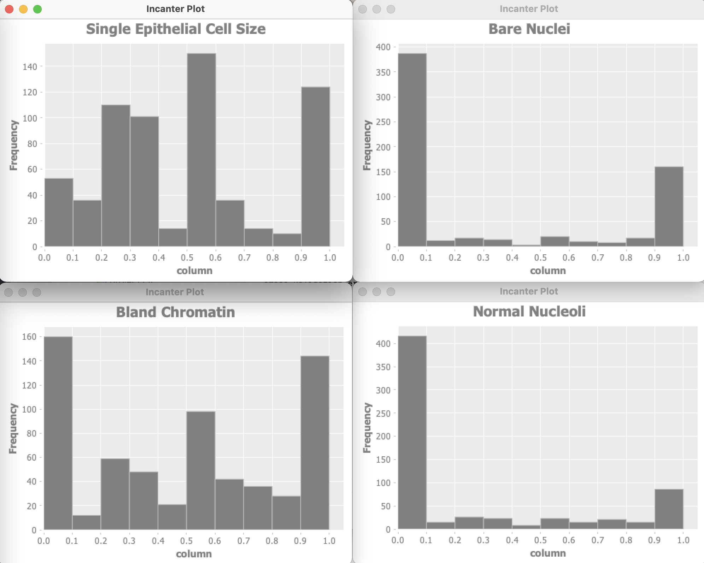

# Anomaly Detection Machine Learning Example

Anomaly detection models are used in one very specific class of use cases: when you have many negative (non-anomaly) examples and relatively few positive (anomaly) examples. We can refer to this as an unbalanced training set. To try an experiment with anomaly detection we can reuse the Wisconsin data. For training we will ignore positive examples in the original data, create a model of "how things should be," and hopefully be able to detect anomalies different from the original negative (non-malignant) examples (i.e., data samples indicating cancer malignancy).

Anomaly detection is a difficult problem. The simple approach we use assumes that each data feature has a Gaussian distribution, or can be made to look like Gaussian distribution using a data transformation; this is often done by taking the logarithm of features, as needed.

If you have a large training set of both negative and positive examples then do not use anomaly detection models. If your training examples are balanced then use a classification model as we saw earlier in the chapter [Deep Learning Using Deeplearning4j](#dl4j).

## Motivation for Anomaly Detection

When should we use anomaly detection? This is important so I am going to repeat my suggestion that you should use supervised learning algorithms like neural networks and logistic classification when there are roughly an equal number of available negative and positive examples in the training data. The University of Wisconsin cancer data set is fairly evenly split between negative and positive examples so I artificially fudged it for this example.

Anomaly detection should be used when you have many negative ("normal") examples and relatively few positive ("anomaly") examples. For the example in this chapter we will simulate scarcity of positive ("anomaly") results by preparing the data using the Wisconsin cancer data as follows:

- We will split the data into training (60%), cross validation (20%) and testing (20%).
- For the training data, we will discard all but two positive ("anomaly") examples. We do this to simulate the real world test case where some positive examples are likely to end up in the training data in spite of the fact that we would prefer the training data to only contain negative ("normal") examples.
- We will use the cross validation data to find a good value for the epsilon meta parameter.
- After we find a good epsilon value, we will calculate the F1 measurement for the model.

## Math Primer for Anomaly Detection

We are trying to model "normal" behavior and we do this by taking each feature and fitting a Gaussian (bell curve) distribution to each feature. The learned parameters for a Gaussian distribution are the mean of the data (where the bell shaped curve is centered) and the variance. You might be more familiar with the term standard deviation, {$$}\sigma{/$$}. Variance is defined as {$$} \sigma ^2{/$$}.

We will need to calculate the probability of a value **x** given the mean and variance of a probability distribution: {$$}P(x : \mu, \sigma ^2){/$$} where {$$}\mu{/$$} is the mean and {$$} \sigma ^2{/$$}
 is the squared variance:

{$$}
P(x : \mu, \sigma ^2) = \frac{1}{{\sigma \sqrt {2\pi } }}e^{{{ - \left( {x - \mu } \right)^2 } \mathord{\left/ {\vphantom {{ - \left( {x - \mu } \right)^2 } {2\sigma ^2 }}} \right. \kern-\nulldelimiterspace} {2\sigma ^2 }}}
{/$$}

where {$$}x_i{/$$} are the samples and we can calculate the squared variance as:

{$$}
\sigma^2 = \frac{\displaystyle\sum_{i=1}^{m}(x_i - \mu)^2} {m}
{/$$}

We calculate the parameters of {$$}\mu{/$$} and {$$} \sigma ^2{/$$} for each feature. A bell shaped distribution in two dimensions is easy to visualize as is an inverted bowl shape in three dimensions. What if we have many features? Well, the math works and don't worry about not being able to picture it in your mind.
 

## AnomalyDetection Utility Class Written in Java

The class **AnomalyDetection** (from my Java AI book) in the directory **src-java** is fairly general purpose. I won't list the Java code in the file **AnomalyDetection.java** here but please do open it in a text editor to refer to while reading this section. This Java class processes a set of training examples and for each feature calculates {$$}\mu{/$$} and {$$} \sigma ^2{/$$}. We are also training for a third parameter: an epsilon "cutoff" value: if for a given input vector {$$}P(x : \mu, \sigma ^2){/$$} evaluates to a value greater than epsilon then the input vector is "normal", less than epsilon implies that the input vector is an "anomaly." The math for calculating these three features from training data is fairly easy but the code is not: we need to organize the training data and search for a value of epsilon that minimizes the error for a cross validation data set.

To be clear: we separate the input examples into three separate sets of training, cross validation, and testing data. We use the training data to set the model parameters, use the cross validation data to learn an epsilon value, and finally use the testing data to get precision, recall, and F1 scores that indicate how well the model detects anomalies in data not used for training and cross validation.

If you are interested in the Java implementation either read the source code or for more detail read the code description in my Java AI book.

## Clojure Experiment for the University of Wisconsin Cancer Data Using Java Anomaly Detection Code

The example in this section loads the University of Wisconsin data and uses the Java class **AnomalyDetection** described in the last section to find anomalies, which for this example will be input vectors that represented malignancy in the original data. We don't train on the non-malignancy samples.

The Wisconsin data has 9 input features and one target output. Optionally the example program can use Incanter to plot the distribution of input variables. For of these plots are shown here:

Let's start by looking at the project file **project.clj**:

{lang="clojure",linenos=on}
~~~~~~~~
(defproject anomaly_detection_clj "0.1.0-SNAPSHOT"
  :description "Anomaly Detection code"
  :url "https://markwatson.com"
  :license
  {:name
   "EPL-2.0 OR GPL-2+ WITH Classpath-exception-2.0"
   :url "https://www.eclipse.org/legal/epl-2.0/"}
  :dependencies [[org.clojure/clojure "1.10.1"]
                 [org.apache.commons/commons-io "1.3.2"]
                 [org.clojure/data.csv "1.0.0"]
                 [incanter "1.9.3"]]
  :source-paths      ["src"]
  :java-source-paths ["src-java"]
  :javac-options     ["-target" "1.8" "-source" "1.8"]
  :main ^:skip-aot anomaly-detection-clj.core
  :target-path "target/%s"
  :profiles
  {:uberjar
      {:aot :all
       :jvm-opts
       ["-Dclojure.compiler.direct-linking=true"]}})
~~~~~~~~

The example code in **src/anomaly_detection/core.clj** is formatted for page width in the following listing:

{lang="clojure",linenos=on}
~~~~~~~~
(ns anomaly-detection-clj.core
  (:gen-class)
  (:require clojure.pprint)
  (:require (incanter core stats charts))
  (:require [clojure.data.csv :as csv])
  (:require [clojure.java.io :as io])
  (:require [clojure.data.csv :as csv]))

(import
 (com.markwatson.anomaly_detection AnomalyDetection))

(def GENERATE_PLOTS false)

(defn print-histogram [title values-2d index-to-display]
  (println "** plotting:" title)
  (let [column (for [row values-2d]
                 (nth row index-to-display))]
    (incanter.core/view
      (incanter.charts/histogram column
                                 :title title))))

(defn data->gausian
  "separate labeled output and then make the data look
   more like a Gausian (bell curve shaped) distribution"
  [vector-of-numbers-as-strings]
  (let [v (map read-string vector-of-numbers-as-strings)
        training-data0 (map
                         (fn [x]
                           (Math/log
                             (+ (* 0.1 x) 1.2)))
                         (butlast v))
        ; target output should be [0,1] instead of [2,4]:
        target-output (* 0.5 (- (last v) 2))
        vmin (apply min training-data0)
        vmax (apply max training-data0)
        training-data (map
                        (fn [x]
                          (/
                            (- x vmin)
                            (+ 0.0001 (- vmax vmin))))
                        training-data0)]
    (concat training-data [target-output])))

(defn testAD []
  (let [ad (AnomalyDetection.)
        cdata
        (map
          data->gausian
          (with-open
            [reader
              (io/reader
               "data/cleaned_wisconsin_cancer_data.csv")]
            (doall
              (csv/read-csv reader))))]
    (if GENERATE_PLOTS
      (do
        (print-histogram "Clump Thickness" cdata 0)
        (print-histogram
          "Uniformity of Cell Size" cdata 1)
        (print-histogram
          "Uniformity of Cell Shape" cdata 2)
        (print-histogram "Marginal Adhesion" cdata 3)
        (print-histogram
          "Single Epithelial Cell Size" cdata 4)
        (print-histogram "Bare Nuclei" cdata 5)
        (print-histogram "Bland Chromatin" cdata 6)
        (print-histogram "Normal Nucleoli" cdata 7)
        (print-histogram "Mitoses" cdata 8)))
    ;; get best model parameters:
    (let [java-cdata (into-array (map double-array cdata))
          detector
          (new AnomalyDetection
            10 (- (count cdata) 1) java-cdata)]
      (. detector train)
      (let [test_malignant
            (double-array [0.5 1 1 0.8 0.5 0.5 0.7 1 0.1])
            test_benign
            (double-array
             [0.5 0.4 0.5 0.1 0.8 0.1 0.3 0.6 0.1])
            malignant_result
            (. detector isAnamoly test_malignant)
            benign_result
            (. detector isAnamoly test_benign)]
        (if malignant_result
          (println "malignant_result true")
          (println "malignant_result false"))
        (if benign_result
          (println "benign_result true")
          (println "benign_result false"))

        ))))
        
(defn -main [& _]
  (testAD))
~~~~~~~~

Data used by an anomaly detection model should have (roughly) a Gaussian (bell curve shape) distribution. What form does the cancer data have? Unfortunately, each of the data features seems to either have a greater density at the lower range of feature values or large density at the extremes of the data feature ranges. This will cause our model to not perform as well as we would like.

I won't do it in this example, but the feature "Bare Nuclei" should be removed because it is not even close to being a bell-shaped distribution. Another thing that you can do (recommended by Andrew Ng in his Coursera Machine Learning class) is to take the log of data and otherwise transform it to something that looks more like a Gaussian distribution.

In a real application you would drop features that you can not transform to something like a Gaussian distribution.

Here are the results of running the code as it is in the GitHub repository for this book (with some verbose output removed for brevity):

{line-numbers=off}
~~~~~~~~
   cross_validation_error_count = 75.0 for epsilon = 0.05
   cross_validation_error_count = 75.0 for epsilon = 0.07
   cross_validation_error_count = 75.0 for epsilon = 0.08
   cross_validation_error_count = 68.0 for epsilon = 0.14
   cross_validation_error_count = 113.0 for epsilon = 0.24
   cross_validation_error_count = 113.0 for epsilon = 0.25
   cross_validation_error_count = 113.0 for epsilon = 0.38
   cross_validation_error_count = 113.0 for epsilon = 0.39
   cross_validation_error_count = 113.0 for epsilon = 0.4
   cross_validation_error_count = 113.0 for epsilon = 0.41
   cross_validation_error_count = 113.0 for epsilon = 0.42
   cross_validation_error_count = 113.0 for epsilon = 0.43
   cross_validation_error_count = 113.0 for epsilon = 0.44

**** Best epsilon value = 0.15000000000000002
   cross_validation_error_count = 63.0 for epsilon = 0.15000000000000002

 -- best epsilon = 0.15000000000000002
 -- number of test examples = 66
 -- number of false positives = 0.0
 -- number of true positives = 8.0
 -- number of false negatives = 11.0
 -- number of true negatives = 47.0
 -- precision = 1.0
 -- recall = 0.42105263157894735
 -- F1 = 0.5925925925925926
malignant_result true
benign_result false
~~~~~~~~

How do we evaluate these results? The precision value of 1.0 means that there were no false positives. False positives are predictions of a true result when it should have been false. The value 0.421 for recall means that of all the samples that should have been classified as positive, we only predicted about 42% of them. The F1 score is calculated as two times the product of precision and recall, divided by the sum of precision plus recall.

We used a simple approach here that has the benefit of working with small data sets. Ideally, even with highly unbalanced data sets, we would have sufficient positive examples to use deep learning to model features, data transformations, and a classification model. In many real-world problems with unbalanced data sets, sufficient data is not available.

