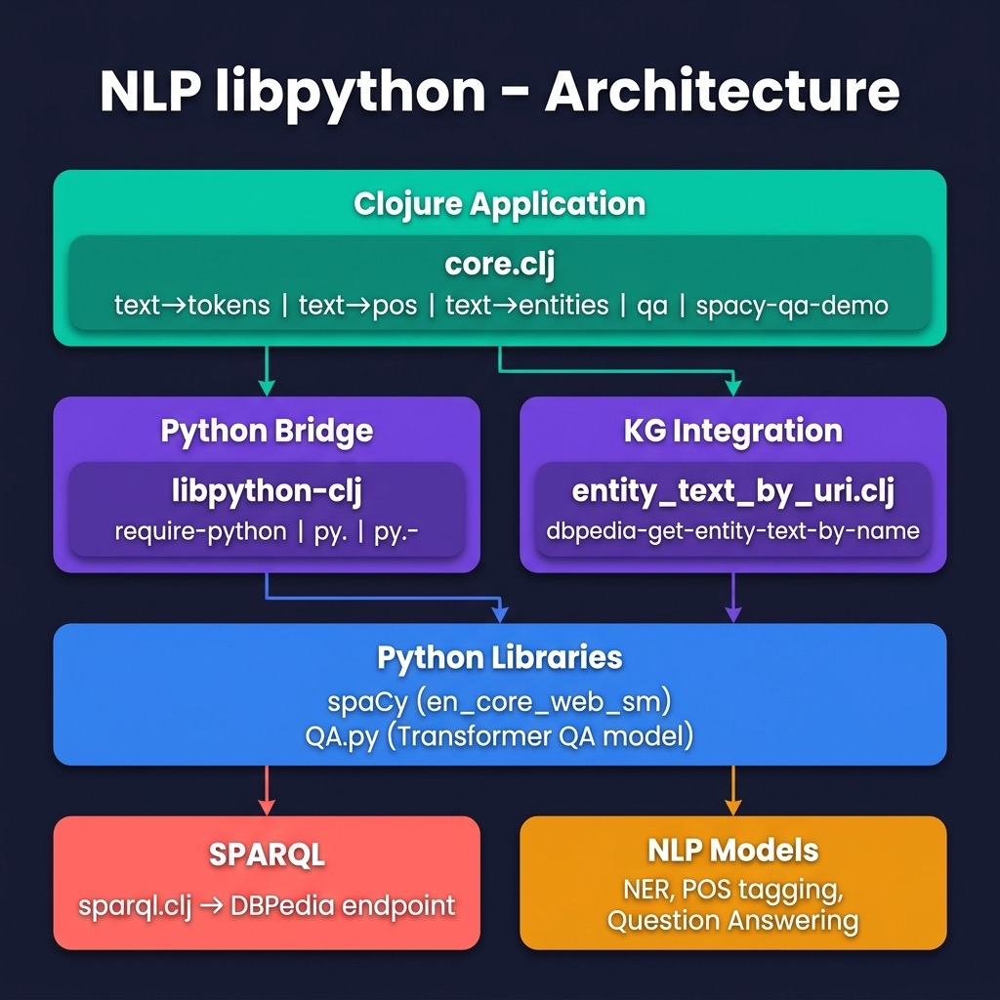

# Using uv and Python/Clojure Interoperation Using the libpython-clj2 Library {#libpython}

In the last chapter we used the Java OpenNLP library for natural language processing (NLP). Here we take an alternative approach of using the **libpython-clj2** library to access the [spaCy](https://spacy.io) NLP library implemented in Python (and the embedded compiled code written in FORTRAN and C/C++). The **libpython-clj2** library can also be used to tap into the wealth of deep learning and numerical computation libraries written in Python. 

This example also uses the [Hugging Face Transformer models](https://huggingface.co/transformers/) for NLP question answering.

**Note: I had removed this chapter from this book because of the difficulties getting the Python and Clojure interoperation setup correctly. Using the `uv` Python package and runtime manager tool, I now find this interoperation to be much simpler so this chapter is back in this book with the `uv` specific setup.**

This project intentionally pairs two Python NLP libraries to illustrate different AI capabilities accessed from Clojure via **libpython-clj2**:

- **spaCy** provides fast, statistical linguistic analysis: tokenization, part-of-speech tagging, and named-entity recognition (NER).
- **Hugging Face Transformers** provides deep learning inference: extractive question answering using a pre-trained BERT model.

The two libraries are combined in the `spacy-qa-demo` function: spaCy extracts named entities from a question, DBPedia SPARQL queries fetch context text about those entities, and the Transformer model answers the question using that context.

To get started using **libpython-clj2** I want to direct you toward two resources that you will want to familiarize yourself with:

- [libpython-clj GitHub repository](https://github.com/clj-python/libpython-clj)

I suggest bookmarking the **libpython-clj2** GitHub repository for reference and note that we now use version .

## Setting Up the Project with uv

We use [uv](https://docs.astral.sh/uv/) to manage the Python virtual environment and dependencies. The project includes a `pyproject.toml` that declares the required Python libraries. The same setup steps work on both macOS and Linux:

{lang="bash",linenos=on}
~~~~~~~~
# Install uv if you don't have it
curl -LsSf https://astral.sh/uv/install.sh | sh

# Install Python deps and download the spaCy model
uv sync
uv run python -m spacy download en_core_web_sm
~~~~~~~~

The `pyproject.toml` file pins the dependencies:

{lang="toml",linenos=on}
~~~~~~~~
[project]
name = "nlp-libpython"
version = "0.1.0"
requires-python = ">=3.12,<3.14"
dependencies = [
    "spacy>=3.8.13",
    "torch>=2.12.0",
    "transformers>=4.30,<5",
]
~~~~~~~~

Note that we pin Python to 3.12–3.13 for compatibility with **libpython-clj**, and Transformers to 4.x because the extractive question-answering pipeline was removed in Transformers 5.x.

To run the project, prefix Leiningen commands with `uv run` so that the Python virtual environment is available:

{lang="bash",linenos=on}
~~~~~~~~
# Run the full demo
uv run lein run

# Or use the REPL interactively
uv run lein repl
~~~~~~~~

## Using spaCy for Natural Language Processing

**spaCy** is a great library that is likely all you need for processing text and NLP. **spaCy** is written in Python and in the past for accessing **spaCy** I have used the Hy language (Clojure syntax Lisp that sits on top of Python), used the **py4cl** library with Common Lisp, or I just used Python. The **libpython-clj** library now gives me a great fourth option.

{width: "80%"}

Let's start by looking at example code in a REPL session and output for this example (we will implement the code later). I reformatted the following output to fit the page width:

{lang=text,linenos=on}
~~~~~~~~
$ uv run lein repl

nlp-libpython-spacy.core=> (def test-text "John Smith
  worked for IBM in Mexico last year and earned $1
  million in salary and bonuses.")
#'nlp-libpython-spacy.core/test-text

nlp-libpython-spacy.core=> (text->entities
                             test-text)
(["John Smith" "PERSON"] ["IBM" "ORG"] ["Mexico" "GPE"]
 ["last year" "DATE"] ["$1 million" "MONEY"])

nlp-libpython-spacy.core=> (text->tokens-and-pos
                             test-text)
(["John" "PROPN"] ["Smith" "PROPN"] ["worked" "VERB"]
 ["for" "ADP"] ["IBM" "PROPN"] ["in" "ADP"]
 ["Mexico" "PROPN"] ["last" "ADJ"] ["year" "NOUN"]
 ["and" "CCONJ"] ["earned" "VERB"] ["$" "SYM"]
 ["1" "NUM"] ["million" "NUM"] ["in" "ADP"]
 ["salary" "NOUN"] ["and" "CCONJ"] ["bonuses" "NOUN"]
 ["." "PUNCT"])

nlp-libpython-spacy.core=> (text->pos test-text)
("PROPN" "PROPN" "VERB" "ADP" "PROPN" "ADP" "PROPN"
 "ADJ" "NOUN" "CCONJ" "VERB" "SYM" "NUM" "NUM"
 "ADP" "NOUN" "CCONJ" "NOUN" "PUNCT")

nlp-libpython-spacy.core=> (text->tokens test-text)
("John" "Smith" "worked" "for" "IBM" "in" "Mexico"
 "last" "year" "and" "earned" "$" "1" "million"
 "in" "salary" "and" "bonuses" ".")
~~~~~~~~

The part of speech tokens are defined in the repository directory for the last chapter in the file **nlp_opennlp/README.md**.
  
## Using the Hugging Face Transformer Models for Question Answering

Deep learning NLP libraries like BERT and and other types of Transformer models have changed the landscape for applications like translation and question answering. Here we use a Hugging Face Transformer Model to answer questions when provided with a block of text that contains the answer to the questions. Before looking at the code for this example, let's look at how it is used:

{lang=clojure",linenos=on}
~~~~~~~~
lp-libpython-spacy.core=> (def context-text "Since last
   year, Bill lives in Seattle. He likes to skateboard.")
#'nlp-libpython-spacy.core/context-text

nlp-libpython-spacy.core=> (qa
                             "where does Bill call home?"
                             context-text)
{'score': 0.9626545906066895, 'start': 31, 'end': 38,
 'answer': 'Seattle'}
 
nlp-libpython-spacy.core=> (qa
                             "what does Bill enjoy?"
                             context-text)
{'score': 0.9084932804107666, 'start': 52, 'end': 62,
 'answer': 'skateboard'}
~~~~~~~~

Nice results that show the power of using publicly available pre-trained deep learning models. Notice that the model handles equating the words "likes" with "enjoy." Similarly, the phrase "call home" is known to be similar to the word "lives." In traditional NLP systems, these capabilities would be handled with a synonym dictionary and a lot of custom code. By training Transformer models of (potentially) hundreds of gigabytes of text, an accurate model of natural language, grammar, synonyms, different sentence structure, etc. are handled with no extra custom code. By using word, phrase, and sentence embeddings Transformer models also learn the relationships between words including multiple word meanings.

Usually the context text block that contains the information to answer queries will be a few paragraphs of text. This is a simple example containing only eleven words. When I use these Transformer models at work I typically provide a few paragraphs of text, which we will also do later in this chapter when we query the public DBPedia Knowledge Graph for context text.

## Combined spaCy and Transformer Question Answering

Let's look at two example queries: "What is the population of Paris?" and "Where does Bill Gates Work?." Here use both the spaCy library and the Hugging Face Transformer library. We also use some material covered in detail later in the book for accessing public Knowledge Graphs to get context text for entities found in the questions we are processing.

Let's use a REPL session to see some results (the printout of the context text is abbreviated for concision). I added a debug printout to the example code to print out the context text (this debug printout is not in the repository for the book example code):

{linenos=on}
~~~~~~~~
lp-libpython-spacy.core=> (spacy-qa-demo
   "what is the population of Paris?")
* * context text: Paris (French pronunciation: ​[paʁi] ()) is the capital and most populous city of France, with an estimated population of 2,150,271 residents as of 2020, in an area of 105 square kilometres (41 square miles). Since the 17th century, Paris has been one of Europe's major centres of finance, diplomacy, commerce, fashion, science and arts.
 The City of Paris is the centre and seat of government of the Île-de-France, or Paris Region ...
 {'score': 0.9000497460365295, 'start': 122, 'end': 131,
  'answer': '2,150,271'}
nlp-libpython-spacy.core=> (spacy-qa-demo
   "where does Bill Gates Work?")
* * context text: William Henry Gates III (born October 28, 1955) is an American business magnate, software developer,
 investor, and philanthropist. He is best known as the co-founder of Microsoft Corporation. During his career at Micro
soft, Gates held the positions of chairman, chief executive officer (CEO), president and chief software architect, while also being the largest individual shareholder until May 2014. He is one of the best-known entrepreneurs and pioneers of the microcomputer revolution of the 1970s and 1980s.
{'score': 0.3064478039741516, 'start': 213, 'end': 222,
 'answer': 'Microsoft'}
~~~~~~~~

This example may take longer to run because the example code is making SPARQL queries to the DBPedia public Knowledge Graph to get context text, a topic we will cover in depth later in the book.

## Using libpython-clj with the spaCy and Hugging Face Transformer Python NLP Libraries

I combined the three examples we just saw in one project for this chapter. Let's start with the Leiningen project file. Note that we use **libpython-clj** version 2.026, which provides Apple Silicon support and modern Python compatibility. The `py/initialize!` call in the Clojure source code points **libpython-clj** at the **uv**-managed `.venv` Python:

{lang="clojure",linenos=on}
~~~~~~~~
(defproject python_interop_deeplearning "0.1.0-SNAPSHOT"
  :description
  "Example using libpython-clj with spaCy"
  :url
  "https://github.com/gigasquid/libpython-clj-examples"
  :license
  {:name
   "EPL-2.0 OR GPL-2+ WITH Classpath-exception-2.0"
   :url "https://www.eclipse.org/legal/epl-2.0/"}
  :jvm-opts ["-Djdk.attach.allowAttachSelf"
             "-XX:+UnlockDiagnosticVMOptions"
             "-XX:+DebugNonSafepoints"
             "-Dlibpython_clj.python_executable=.venv/bin/python"]
   :dependencies [[org.clojure/clojure "1.11.1"]
                  [clj-python/libpython-clj "2.026"]
                  [clj-http "3.10.3"]
                  [com.cemerick/url "0.1.1"]
                  [org.clojure/data.csv "1.0.0"]
                  [org.clojure/data.json "1.0.0"]]
  :main ^:skip-aot nlp-libpython-spacy.core
  :target-path "target/%s"
  :profiles
  {:uberjar
    {:aot :all
          :jvm-opts
          ["-Dclojure.compiler.direct-linking=true"]}})
~~~~~~~~

Before looking at the example code, let's go back to a REPL session to experiment with **libpython-clj** Python accessor functions. In the following example we call directly into the **spaCy** library and we use a separate Python file **QA.py** to wrap the Hugging Face Transformer mode. This provides you, dear reader, with examples of both techniques I use (direct calls and using separate Python wrappers). We will list the file **QA.py** later.

In lines 1-7 of the example program we set up the Clojure namespace, define accessor functions for interacting with Python, and initialize the Python runtime pointing at the **uv**-managed virtual environment. Before we jump into the example code listing, I want to show you a few things in a REPL:

{linenos=on}
~~~~~~~~
$ uv run lein repl
nlp-libpython-spacy.core=> (nlp "The cat ran")
The cat ran
nlp-libpython-spacy.core=> (type (nlp "The cat ran"))
:pyobject
~~~~~~~~

The output on line 3 prints as a string but is really a Python object (a **spaCy** **Document**) returned as a value from the wrapped **nlp** function. The Python **dir** function prints all methods and attributes of a Python object. Here, I show only four out of the  eighty-eight methods and attributes on a **spaCy** **Document** object:

{linenos=on}
~~~~~~~~
nlp-libpython-spacy.core=> (py/dir (nlp "The cat ran"))
["__iter__" "lang" "sentiment" "text" "to_json" ...]
~~~~~~~~

The method **__iter__** is a Python iterator and allows Clojure code using **libpython-clj** to iterate through a Python collection using the Clojure **map** function as we will see in the example program. The **text** method returns a string representation of a **spaCy** **Document** object and we will also use **text** to get the print representation of **spaCy** **Token** objects.

Here we call two of the wrapper functions in our example:

{linenos=on}
~~~~~~~~
nlp-libpython-spacy.core=> (text->tokens "the cat ran")
("the" "cat" "ran")
nlp-libpython-spacy.core=> (text->tokens-and-pos
                             "the cat ran")
(["the" "DET"] ["cat" "NOUN"] ["ran" "VERB"])
~~~~~~~~

Now let's look at the listing of the example project for this chapter. In lines 6-7 we initialize the Python runtime, pointing **libpython-clj** at the **uv**-managed `.venv/bin/python`. The Python file **QA.py** loaded in line 10 will be seen later. The **spaCy** library requires a model file to be loaded as seen in line 12.

The combined demo that uses **spaCY**, the transformer model, and queries the public DBPedia Knowledge Graph is implemented in function **spacy-qa-demo** (lines 39-59). In line 50 we call a utility function **dbpedia-get-entity-text-by-name** that is described in a later chapter; for now it is enough to know that it uses the SPARQL query template in the file **get_entity_text.sparql** to get context text for an entity from DBPedia. This code is wrapped in the local function **get-text-fn** that is called for each entity name from in the natural language query.

{lang="clojure",linenos=on}
~~~~~~~~
(ns nlp-libpython-spacy.core
  (:require [libpython-clj2.require :refer
                                    [require-python]]
            [libpython-clj2.python :as py
                                   :refer
                                   [py. py.-]]))

(py/initialize! :python-executable
  (str (System/getProperty "user.dir")
       "/.venv/bin/python"))

(require-python '[spacy :as sp])
(require-python '[QA :as qa]) ;; loads the file QA.py

(def nlp (sp/load "en_core_web_sm"))

(def test-text "John Smith worked for IBM in Mexico last year and earned $1 million in salary and bonuses.")

(defn text->tokens [text]
  (map (fn [token] (py.- token text))
       (nlp text)))

(defn text->pos [text]
  (map (fn [token] (py.- token pos_))
       (nlp text)))
  
(defn text->tokens-and-pos [text]
  (map (fn [token] [(py.- token text) (py.- token pos_)])
       (nlp text)))

(defn text->entities [text]
  (map (fn [entity] (py.- entity label_))
       (py.- (nlp text) ents)))

(defn qa
  "Use Transformer model for question answering"
  [question context-text]
  ;; prints to stdout and returns a map:
  (qa/answer question context-text))

(defn spacy-qa-demo [natural-language-query]
  (let [entity-map
        {"PERSON" "<http://dbpedia.org/ontology/Person>"
         "ORG"
         "<http://dbpedia.org/ontology/Organization>"
         "GPE"    "<http://dbpedia.org/ontology/Place>"}
        entities (text->entities natural-language-query)
        get-text-fn
        (fn [entity]
          (clojure.string/join
           " "
           (for [entity entities]
             (kgn/dbpedia-get-entity-text-by-name
              (first entity)
              (get entity-map (second entity))))))
        context-text
        (clojure.string/join
          " "
          (for [entity entities]
            (get-text-fn entity)))
        _ (println "* * context text:" context-text)
        answer (qa natural-language-query context-text)]
    answer))

(defn -main
  [& _]
  (println (text->entities test-text))
  (println (text->tokens-and-pos test-text))
  (println (text->pos test-text))
  (println (text->tokens test-text))
  (qa "where does Bill call home?"
      "Since last year, Bill lives in Seattle. He likes to skateboard.")
  (qa "what does Bill enjoy?"
      "Since last year, Bill lives in Seattle. He likes to skateboard.")
  (spacy-qa-demo "what is the population of Paris?")
  (spacy-qa-demo "where does Bill Gates Work?"))
~~~~~~~~

If you run `uv run lein run` to run the test **-main** function in the last listing, you will see the sample output that we saw earlier.

This example also shows how to load (see line 10 in the last listing) the local Python file **QA.py** and call a function defined in the file:

{lang="python",linenos=on}
~~~~~~~~
from transformers import pipeline

qa = pipeline(
    "question-answering",
    model="NeuML/bert-small-cord19-squad2",
    tokenizer="NeuML/bert-small-cord19qa"
)

def answer (query_text,context_text):
  if not context_text or not context_text.strip():
    result = {'score': 0.0, 'start': 0, 'end': 0,
              'answer': ''}
    print(result)
    return result
  answer = qa({
                "question": query_text,
                "context": context_text
               })
  print(answer)
  return answer
~~~~~~~~

Lines 3-7 specify a pre-trained model and tokenizer. The `answer` function includes a guard for empty context text — this can happen when the DBPedia SPARQL query returns no results for a particular entity.

Writing a Python wrapper that is called from your Clojure code is a good approach if, for example, you had existing Python code that uses TensorFlow or PyTorch, or there was a complete application written in Python that you wanted to use from Clojure. While it is possible to do everything in Clojure calling directly into Python libraries it is sometimes simpler to write Python wrappers that define top level functions that you need in your Clojure project.

The material in this chapter is of particular interest to me because I use both NLP and Knowledge Graph technologies in my work. With the ability to access the Python **spaCY** and Hugging Face Transformer models, as well as the Java Jena library for semantic web and Knowledge Graph applications (more on this topic later), Clojure is a nice language to use for my projects.

## Optional Practice Problems

1. **NumPy Integration**: Set up a bridge to the Python `numpy` library using `libpython-clj` in `source-code/nlp_libpython` and perform basic matrix operations like transposition and multiplication.
2. **Library Version Checker**: Write a helper function in Clojure to retrieve and print the version numbers of all imported Python packages dynamically.
3. **Python Error Handling**: Implement robust error handling in Clojure to catch and format Python-side exceptions gracefully during data transfer.
