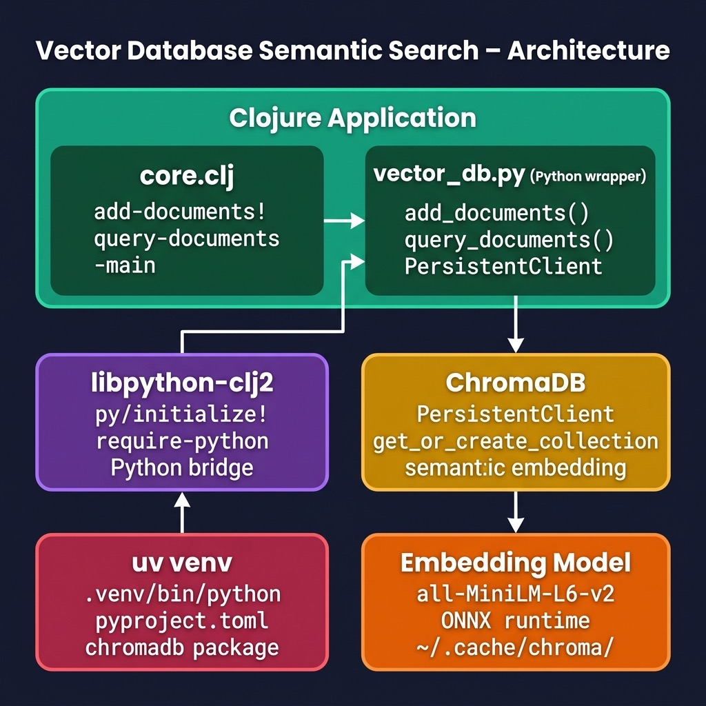

# Semantic Search Using a Vector Database and Python and uv Interoperability {#vectordb-python}

In this chapter we build a local semantic search engine using [ChromaDB](https://www.trychroma.com), a high-performance open-source vector database, accessed from Clojure via the **libpython-clj2** Python interoperability bridge. The dependency management for the Python side is handled by [uv](https://docs.astral.sh/uv/), which provides a fast, reproducible virtual environment.

This chapter is closely related to the earlier **libpython-clj2** chapter — the same bridge that let us call spaCy and Hugging Face models is used here to call ChromaDB's Python client. If you have already worked through that chapter you will find the setup familiar; if not, you can still follow along since this project is self-contained.

The source code for this chapter is in the directory **source-code/vectordb_semantic_search_python** of the GitHub repository for this book: [https://github.com/mark-watson/Clojure-AI-Book](https://github.com/mark-watson/Clojure-AI-Book).

## What Is a Vector Database?

A vector database stores documents not as plain text but as dense numerical vectors (also called **embeddings**). An embedding is a list of floating-point numbers — typically hundreds or thousands of dimensions long — that captures the _meaning_ of a piece of text. Documents with similar meanings end up with embeddings that are geometrically close to each other.

When you perform a **semantic search** you supply a query string, convert it to an embedding using the same model that was used to embed the documents, and then find the stored embeddings that are closest to the query embedding. The result is a ranked list of documents that are semantically related to your query — not merely documents that contain the same keywords.

ChromaDB automates the embedding step: you supply raw text and ChromaDB calls the **all-MiniLM-L6-v2** transformer model (via the ONNX runtime) to produce embeddings automatically. The model is downloaded on first use to `~/.cache/chroma/onnx_models/` and cached for subsequent runs.

## Architecture Overview

{width: "80%"}

The application is structured in two layers:

1. **Python layer** — `vector_db.py` wraps the ChromaDB `PersistentClient`. It exposes two plain functions, `add_documents` and `query_documents`, so that the Clojure code never has to deal with ChromaDB's Python objects directly.
2. **Clojure layer** — `core.clj` initialises the **libpython-clj2** bridge pointing at the **uv**-managed virtual environment, imports `vector_db.py` as a Python module, and exposes idiomatic Clojure functions that return plain Clojure maps.

## Setting Up the Project with uv

The Python dependencies are declared in `pyproject.toml`:

{lang="toml",linenos=on}
~~~~~~~~
[project]
name = "vectordb-semantic-search"
version = "0.1.0"
requires-python = ">=3.12,<3.14"
dependencies = [
    "chromadb>=0.6.0",
]
~~~~~~~~

Install the virtual environment with a single command:

{lang="bash",linenos=on}
~~~~~~~~
uv sync
~~~~~~~~

To run the project, prefix Leiningen commands with `uv run` so that the virtual environment Python is on the path and **libpython-clj2** can find it:

{lang="bash",linenos=on}
~~~~~~~~
# Run the demo
uv run lein run

# Interactive REPL
uv run lein repl
~~~~~~~~

## The Python Wrapper: vector_db.py

Keeping the Python code in a thin wrapper module is a pattern recommended throughout this book. It makes the ChromaDB API easy to call from Clojure because all argument types are plain Python primitives (strings and lists):

{lang="python",linenos=on}
~~~~~~~~
import chromadb

# Initialize a local persistent database
client = chromadb.PersistentClient(path="./chroma_db")

def add_documents(collection_name, documents, metadatas, ids):
    """
    Add a collection of documents with metadata and unique IDs
    to the vector database.
    """
    collection = client.get_or_create_collection(
        name=collection_name)
    # Ensure lists are passed as standard python lists
    # (libpython-clj passes them as iterable collections)
    collection.add(
        documents=list(documents),
        metadatas=list(metadatas),
        ids=list(ids)
    )
    return True

def query_documents(collection_name, query_text, n_results=2):
    """
    Perform semantic search and return a list of maps
    containing id, document, metadata, and distance.
    """
    collection = client.get_or_create_collection(
        name=collection_name)
    results = collection.query(
        query_texts=[query_text],
        n_results=int(n_results)
    )

    formatted = []
    if results and 'documents' in results \
               and results['documents']:
        docs      = results['documents'][0]
        metas     = results['metadatas'][0]
        distances = results['distances'][0]
        ids       = results['ids'][0]

        for i in range(len(docs)):
            formatted.append({
                "id":       ids[i],
                "document": docs[i],
                "metadata": metas[i] if metas[i] else {},
                "distance": float(distances[i])
            })
    return formatted
~~~~~~~~

A few design decisions worth noting:

- **`PersistentClient`** stores the ChromaDB data on disk under `./chroma_db/`. This means the collection survives across runs; you can add documents in one session and query them in another.
- **`get_or_create_collection`** is idempotent — it creates the collection if it does not exist, and returns it if it does.
- The `list()` wrappers in `add_documents` are important because **libpython-clj2** passes Clojure sequences as Java iterables, not Python lists. ChromaDB's `collection.add` requires genuine Python lists.
- The returned `formatted` list contains Python dicts with string keys. **libpython-clj2** converts these automatically to Clojure maps with keyword keys when they are received on the Clojure side.

## The Clojure Orchestration Layer: core.clj

The Leiningen project file declares a single external dependency — **libpython-clj2** — plus several JVM options required to make the Python bridge work correctly on modern JVMs:

{lang="clojure",linenos=on}
~~~~~~~~
(defproject vectordb_semantic_search "0.1.0-SNAPSHOT"
  :description
  "Semantic search example using libpython-clj and ChromaDB"
  :url
  "https://github.com/mark-watson/Clojure-AI-Book"
  :license {:name "EPL-2.0 OR GPL-2.0-or-later ..."
            :url  "https://www.eclipse.org/legal/epl-2.0/"}
  :jvm-opts ["-Djdk.attach.allowAttachSelf"
             "-XX:+UnlockDiagnosticVMOptions"
             "-XX:+DebugNonSafepoints"
             "-Dlibpython_clj.python_executable=.venv/bin/python"]
  :dependencies [[org.clojure/clojure "1.11.1"]
                 [clj-python/libpython-clj "2.026"]]
  :main ^:skip-aot
        vectordb-semantic-search-python.core
  :target-path "target/%s"
  :profiles {:uberjar
             {:aot :all
              :jvm-opts
              ["-Dclojure.compiler.direct-linking=true"]}})
~~~~~~~~

The main source file `src/vectordb_semantic_search_python/core.clj` initialises Python, loads the wrapper, and provides idiomatic Clojure wrappers:

{lang="clojure",linenos=on}
~~~~~~~~
(ns vectordb-semantic-search-python.core
  (:require [libpython-clj2.require :refer [require-python]]
            [libpython-clj2.python :as py
             :refer [py. py.-]]))

;; Point libpython-clj2 at the uv-managed venv Python
(py/initialize!
  :python-executable
  (str (System/getProperty "user.dir")
       "/.venv/bin/python"))

;; Import the local Python wrapper
(require-python '[vector_db :as db])

(defn add-documents!
  "Adds documents to a named ChromaDB collection.
   documents, metadatas, and ids should be Clojure vectors."
  [collection-name documents metadatas ids]
  (db/add_documents collection-name
                    documents metadatas ids))

(defn query-documents
  "Semantic search against a collection.
   Returns a sequence of Clojure maps with keys
   :id, :document, :metadata, and :distance."
  [collection-name query-text n-results]
  (db/query_documents collection-name
                      query-text n-results))

(defn -main
  [& _]
  (println "=== Starting Vector DB Semantic Search Demo ===")
  (let [collection "clojure_ai_docs"
        docs
        ["Clojure is a modern Lisp dialect that targets
          the JVM, CLR, and JavaScript. It features
          functional programming and immutable data
          structures."
         "Python is an interpreted, high-level,
          general-purpose programming language. It is
          widely used in data science, AI, and machine
          learning."
         "French onion soup is a soup made from onions,
          beef stock, and usually served with cheese and
          bread."
         "Generative adversarial networks (GANs) are a
          class of machine learning frameworks where two
          neural networks contest with each other in a
          game."]
        metadatas [{"type" "programming" "lang" "clojure"}
                   {"type" "programming" "lang" "python"}
                   {"type" "food"        "cuisine" "french"}
                   {"type" "ai"          "topic" "gan"}]
        ids ["id_clojure" "id_python"
             "id_soup"    "id_gan"]]

    (println "Inserting sample documents...")
    (add-documents! collection docs metadatas ids)
    (println "Documents inserted successfully.")

    (println "
--- Query 1: 'neural network architectures' ---")
    (let [results
          (query-documents collection
                           "neural network architectures"
                           2)]
      (doseq [res results]
        (println "Match:"    (:document res))
        (println "Metadata:" (:metadata res))
        (println "Distance:" (:distance res) "
")))

    (println "--- Query 2: 'functional programming language' ---")
    (let [results
          (query-documents collection
                           "functional programming language"
                           1)]
      (doseq [res results]
        (println "Match:"    (:document res))
        (println "Metadata:" (:metadata res))
        (println "Distance:" (:distance res) "
")))

    (println "--- Query 3: 'cooking recipes and food' ---")
    (let [results
          (query-documents collection
                           "cooking recipes and food" 1)]
      (doseq [res results]
        (println "Match:"    (:document res))
        (println "Metadata:" (:metadata res))
        (println "Distance:" (:distance res) "
")))
    (shutdown-agents)))
~~~~~~~~

Several things are worth highlighting:

- **`py/initialize!`** — called once at the top of the namespace, not inside a function. It starts the embedded Python interpreter and informs **libpython-clj2** which Python binary to use. Pointing it at `.venv/bin/python` ensures the ChromaDB package (and its ONNX dependencies) are visible.
- **`require-python`** — loads `vector_db.py` from the current working directory (where Leiningen is run) and binds it to the alias `db`. Calls to `db/add_documents` and `db/query_documents` translate directly to calls to the Python functions of the same names.
- **`shutdown-agents`** — called at the end of `-main` to cleanly terminate Clojure's thread pool. Without this call the JVM would hang for a noticeable period waiting for non-daemon threads to finish before exiting.

## Running the Demo

{lang="bash",linenos=on}
~~~~~~~~
$ uv run lein run
=== Starting Vector DB Semantic Search Demo ===
Inserting sample documents...
Documents inserted successfully.

--- Query 1: 'neural network architectures' ---
Match: Generative adversarial networks (GANs) are a class
       of machine learning frameworks where two neural
       networks contest with each other in a game.
Metadata: {'type': 'ai', 'topic': 'gan'}
Distance: 1.322404384613037

Match: French onion soup is a soup made from onions, beef
       stock, and usually served with cheese and bread.
Metadata: {'type': 'food', 'cuisine': 'french'}
Distance: 1.7437050342559814

--- Query 2: 'functional programming language' ---
Match: Clojure is a modern Lisp dialect that targets the
       JVM, CLR, and JavaScript. It features functional
       programming and immutable data structures.
Metadata: {'lang': 'clojure', 'type': 'programming'}
Distance: 0.9769030213356018

--- Query 3: 'cooking recipes and food' ---
Match: French onion soup is a soup made from onions, beef
       stock, and usually served with cheese and bread.
Metadata: {'type': 'food', 'cuisine': 'french'}
Distance: 1.4435760974884033
~~~~~~~~

The results demonstrate **semantic** matching. Query 1 asks about _neural network architectures_; the GAN document ranks first even though neither the word "architecture" nor "neural network" appears in that document verbatim — the model understands that GANs _are_ a class of neural network architectures.

Similarly, Query 2 retrieves the Clojure document (not the Python one) because functional programming and immutable data are distinctly Clojure concepts. Query 3 correctly returns the French onion soup document for a query about cooking.

Note that the **distance** values are L2 (Euclidean) distances between embedding vectors, not similarity scores. Smaller values indicate a closer (more similar) match. ChromaDB uses the `all-MiniLM-L6-v2` model, which generates 384-dimensional embeddings — a good balance between quality and speed for local use.

## Note on the Model Cache

The first time you run the example, ChromaDB downloads the `all-MiniLM-L6-v2` model weights in ONNX format to:

    ~/.cache/chroma/onnx_models/

This directory can grow to several hundred megabytes. If you want to reclaim the disk space after experimenting, you can safely delete it; ChromaDB will re-download on the next run.

## Wrap Up

In this chapter we demonstrated how to use a modern vector database — ChromaDB — from Clojure by leveraging the **libpython-clj2** bridge and **uv** for Python dependency management. The key ideas are:

- Wrap the Python library in a thin Python module (`vector_db.py`) that exposes simple functions taking and returning only primitive types. This makes the bridge straightforward and avoids dealing with opaque Python objects in Clojure.
- Use `uv sync` and `uv run` to manage the Python virtual environment reproducibly alongside the Leiningen project.
- Call `shutdown-agents` at the end of `-main` to avoid a slow JVM exit when using libpython-clj2.

This same pattern scales to any Python library: wrap it in a thin Python module, initialize the bridge pointing at your uv venv, and call in from idiomatic Clojure code.

## Optional Practice Problems

1. **Metadata Filtering**: Add a new metadata field (e.g., `author` or `publish_date`) to the vector payloads in `source-code/vectordb_semantic_search_python` and perform queries with metadata-filtered criteria.
2. **Distance Metric Evaluation**: Experiment with a different distance metric (e.g., L2 distance vs. cosine similarity) in your vector database configuration and observe any differences in search results.
3. **Batch Insertion**: Write a script to batch insert a list of 50 custom text chunks and print the top 3 matches for a target query.
