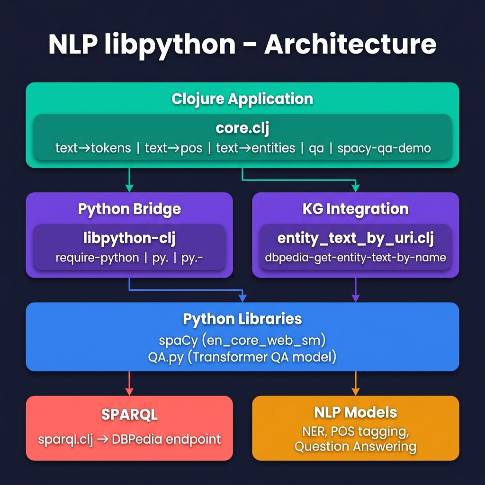

# Python/Clojure Interop with spaCy and Transformers using 'uv' for Python environment management

Example for *Practical Artificial Intelligence Programming With Clojure*

This project demonstrates calling Python NLP libraries from Clojure using [libpython-clj](https://github.com/clj-python/libpython-clj). It showcases two complementary Python AI libraries working together through a single Clojure application.

## Dual Example: spaCy + Hugging Face Transformers

This project intentionally pairs **two** Python NLP libraries to illustrate different AI capabilities accessed from Clojure via `libpython-clj`:

| Library | Role | What it does |
|---------|------|-------------|
| **spaCy** | Linguistic analysis | Tokenization, part-of-speech tagging, named-entity recognition (NER). Fast, rule-based + statistical pipeline for understanding text structure. |
| **Hugging Face Transformers** | Deep learning inference | Extractive question answering using a pre-trained BERT model (`NeuML/bert-small-cord19-squad2`). Finds answer spans within context text. |

The two libraries are combined in `spacy-qa-demo`: spaCy extracts named entities from a question, DBPedia SPARQL queries fetch context text about those entities, and the Transformer model answers the question using that context.

## Prerequisites

| Tool | Notes |
|------|-------|
| [uv](https://docs.astral.sh/uv/) | Manages the Python venv and dependencies |
| Java 11+ | |
| [Leiningen](https://leiningen.org) | 2.9+ |

## Setup (macOS & Linux)

[uv](https://docs.astral.sh/uv/) manages the Python virtual environment and dependencies via the included `pyproject.toml`. The same steps work on both macOS and Linux.

```bash
# Install uv if you don't have it
curl -LsSf https://astral.sh/uv/install.sh | sh

# Install Python deps and download the spaCy model
uv sync
uv run python -m spacy download en_core_web_sm
```

## Run

```bash
# Run the full demo (spaCy NER + Transformers QA + Knowledge Graph)
uv run lein run

# Or use the REPL interactively
uv run lein repl

# Run the Python QA script standalone
uv run python QA.py
```

## Architecture



## Book and License

Book URI: https://leanpub.com/clojureai — you can read the book for free online at https://leanpub.com/clojureai/read

Copyright © 2021-2026 Mark Watson. All rights reserved.

This program and the accompanying materials are made available under the
terms of the Eclipse Public License 2.0 which is available at
http://www.eclipse.org/legal/epl-2.0.

