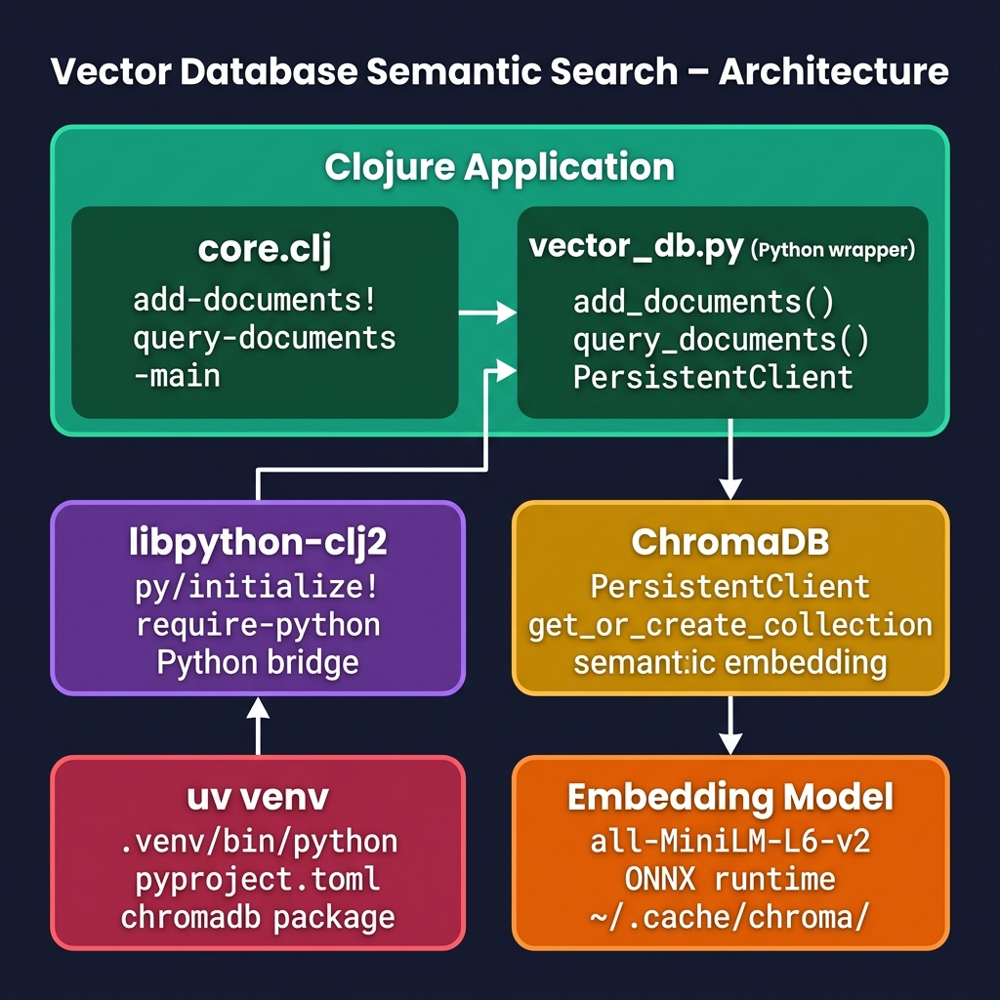

# Vector Database and Semantic Search using ChromaDB and 'uv'

This project demonstrates how to connect Clojure to a modern, high-performance local Vector Database (ChromaDB) using Python interoperation via [libpython-clj](https://github.com/clj-python/libpython-clj) and the Astral [uv](https://docs.astral.sh/uv/) tool for dependency management.

## How it Works

1. **`vector_db.py`**: A Python wrapper that instantiates a persistent ChromaDB instance locally under `chroma_db/`. It provides simple functions to add documents (along with metadata and unique IDs) and query them. ChromaDB automatically generates semantic embeddings using the `all-MiniLM-L6-v2` transformer model under the hood.
2. **`core.clj`**: The Clojure orchestration code. It initializes the embedded Python interpreter using the `uv` virtual environment Python executable, loads the Python wrapper, and provides high-level Clojure search functions that return plain Clojure maps.

## Downloaded Model

Please note that the first time this example is run, there is a model downloaded into:

    ~/.cache/chroma/onnx_models/

that you might want to delete later.

## Prerequisites

- [uv](https://docs.astral.sh/uv/)
- Java 11+
- [Leiningen](https://leiningen.org)

## Setup

Run the following commands to initialize the Python virtual environment and install all dependencies:

```bash
# Sync dependencies
uv sync
```

## Run

To run the semantic search demonstration:

```bash
# Run Clojure main
uv run lein run
```

You can also start an interactive Clojure REPL:

```bash
# Start REPL
uv run lein repl
```

## Architecture



## Book and License

Book URI: https://leanpub.com/clojureai — you can read the book for free online at https://leanpub.com/clojureai/read

Copyright © 2023-2026 Mark Watson. All rights reserved.

This program and the accompanying materials are made available under the
terms of the Eclipse Public License 2.0 which is available at
http://www.eclipse.org/legal/epl-2.0.
